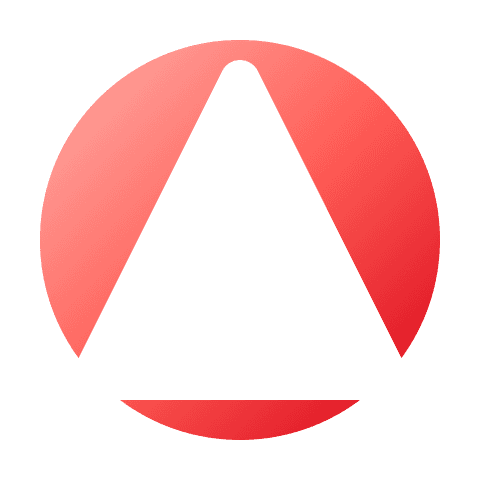

<p align="center">
  
</p>

<h1 align="center">OpenAva</h1>

<p align="center">
  <strong>A native Apple app for persistent personal AI agent teams.</strong>
</p>

<p align="center">
  Run specialized agents, keep their memory and workspaces, and coordinate them as durable teams across iPhone, iPad, and Mac.
</p>

<p align="center">
  <a href="https://github.com/Day1Labs/OpenAva/actions/workflows/build-mac-app.yml"></a>
  <a href="LICENSE"></a>
  
  
</p>

---

## Why OpenAva

Most AI assistants still feel like isolated chat windows. OpenAva is built around a different idea: agents should live closer to your personal computing environment, keep useful context over time, and collaborate as a real working unit.

OpenAva brings that model to Apple platforms with:

- native iOS and macOS experiences
- personal agents with their own identity, tools, memory, and workspace
- agent teams that can coordinate work instead of forcing every task through one assistant
- persistent sessions and searchable conversation history
- local or remote gateway connectivity for device-aware actions
- configurable model providers and endpoints

The goal is to make multi-agent workflows practical for everyday personal work, not just a prompt-engineering demo.

## Download a Development Build

The latest macOS development build is generated from the latest successful `main` workflow run.

- [Download OpenAva-macOS-dev.zip](https://github.com/Day1Labs/OpenAva/releases/download/dev-build/OpenAva-macOS-dev.zip)
- [Download checksum](https://github.com/Day1Labs/OpenAva/releases/download/dev-build/OpenAva-macOS-dev.zip.sha256)

The development build is Developer ID signed and notarized.

## What You Can Do

| Area | What OpenAva enables |
| --- | --- |
| Personal agents | Create agents with distinct roles, settings, workspaces, tools, and runtime context. |
| Agent teams | Group specialized agents into a persistent team that can plan, delegate, execute, and review together. |
| Chat and sessions | Keep ongoing conversations, return to earlier work, and continue long-running tasks over time. |
| Memory and history | Let agents retain useful long-term context while preserving searchable past conversations. |
| Skills and automation | Package repeatable workflows as skills and run scheduled or shortcut-driven automations. |
| Device-aware tools | Connect agents to device surfaces such as files, notifications, media, contacts, calendar, reminders, and more. |
| Model flexibility | Bring your own model providers, configure endpoints, and switch between provider profiles. |
| Remote control | Access and steer active agent workflows from another device when needed. |
| Localization | Use the app in English or Simplified Chinese. |

## Agent Teams

OpenAva treats teams as a first-class product surface, not a temporary prompt trick.

Instead of asking one general-purpose assistant to do everything, you can create a durable group of agents around a working context. A team might include:

- a planner that turns vague goals into a concrete plan
- an executor that uses tools and carries out steps
- a reviewer that checks quality, risks, and missing details

Each agent can keep its own role and workspace while still collaborating inside the same team flow. That makes OpenAva useful for people who want repeatable personal workflows, not just one-off chats.

## Quick Start

### Try the macOS development build

1. Download [OpenAva-macOS-dev.zip](https://github.com/Day1Labs/OpenAva/releases/download/dev-build/OpenAva-macOS-dev.zip).
2. Optionally verify the archive with [OpenAva-macOS-dev.zip.sha256](https://github.com/Day1Labs/OpenAva/releases/download/dev-build/OpenAva-macOS-dev.zip.sha256).
3. Launch OpenAva.
4. Configure an LLM provider in **Settings > LLM**.
5. Connect the app to a compatible OpenClaw gateway environment.
6. Create your first agent or team and start chatting.

### Build from source

```bash
git clone https://github.com/Day1Labs/OpenAva.git
cd OpenAva
open OpenAva.xcodeproj
```

Then let Swift Package Manager resolve dependencies, select the `OpenAva` scheme, and build for a supported simulator, device, or Mac Catalyst target.

## Requirements

To run OpenAva:

- iOS 18.0+ or macOS 15.0+ via Mac Catalyst
- at least one configured LLM endpoint
- access to a compatible OpenClaw gateway node for device-aware actions

To develop OpenAva:

- Xcode 26+
- Swift 6.2+

## Build from the Command Line

Build the iOS app for Simulator:

```bash
xcodebuild \
  -project OpenAva.xcodeproj \
  -scheme OpenAva \
  -configuration Debug \
  -destination 'generic/platform=iOS Simulator' \
  CODE_SIGNING_ALLOWED=NO \
  build
```

Build the macOS app via Mac Catalyst:

```bash
xcodebuild \
  -project OpenAva.xcodeproj \
  -scheme OpenAva \
  -configuration Release \
  -destination 'generic/platform=macOS,variant=Mac Catalyst' \
  CODE_SIGNING_ALLOWED=NO \
  build
```

## Repository Map

| Path | Purpose |
| --- | --- |
| `OpenAva/` | Main Apple-platform app source. |
| `ChatKit/` | Chat UI and model-provider client package. |
| `OpenClawKit/` | Gateway, device command, and local control support. |
| `ActivityWidget/` | Widget and live activity surfaces. |
| `OpenAvaTests/` | App-level runtime and feature tests. |
| `DESIGN.md` | Visual design guidelines for the product. |

## Good First Contributions

OpenAva is early and benefits most from contributions that make the project easier to try, understand, and trust:

- clearer setup docs for gateway and model-provider configuration
- issue reports with exact device, OS, model provider, and gateway details
- agent/team templates that demonstrate real workflows
- screenshots, demo videos, and onboarding improvements
- focused tests around runtime, memory, tools, and team coordination
- fixes that make the development build smoother for first-time users

## Project Links

- Website: [day1-labs.com/openava](https://day1-labs.com/openava/)
- Releases: [github.com/Day1Labs/OpenAva/releases](https://github.com/Day1Labs/OpenAva/releases)
- License: [MIT](LICENSE)
